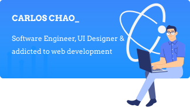

# Hello 👋, I’m Carlos Chao

I love programming, and I'm always on the lookout for new challenges.

## Languages and Tools:

Javascript, Typescript, NodeJs, Python,  ReactJs, VueJs, Figma, and others …

## Project Relates
- gsi-ui
- fluvx
- couchbase/node-ottoman

<!--
**gsi-chao/gsi-chao** is a ✨ _special_ ✨ repository because its `README.md` (this file) appears on your GitHub profile.

Here are some ideas to get you started:

- 🔭 I’m currently working on ...
- 🌱 I’m currently learning ...
- 👯 I’m looking to collaborate on ...
- 🤔 I’m looking for help with ...
- 💬 Ask me about ...
- 📫 How to reach me: ...
- 😄 Pronouns: ...
- ⚡ Fun fact: ...
-->
